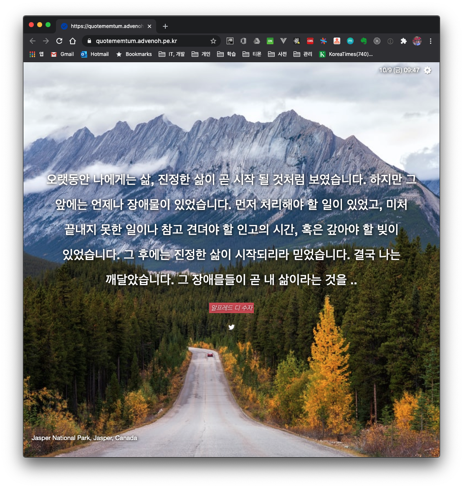
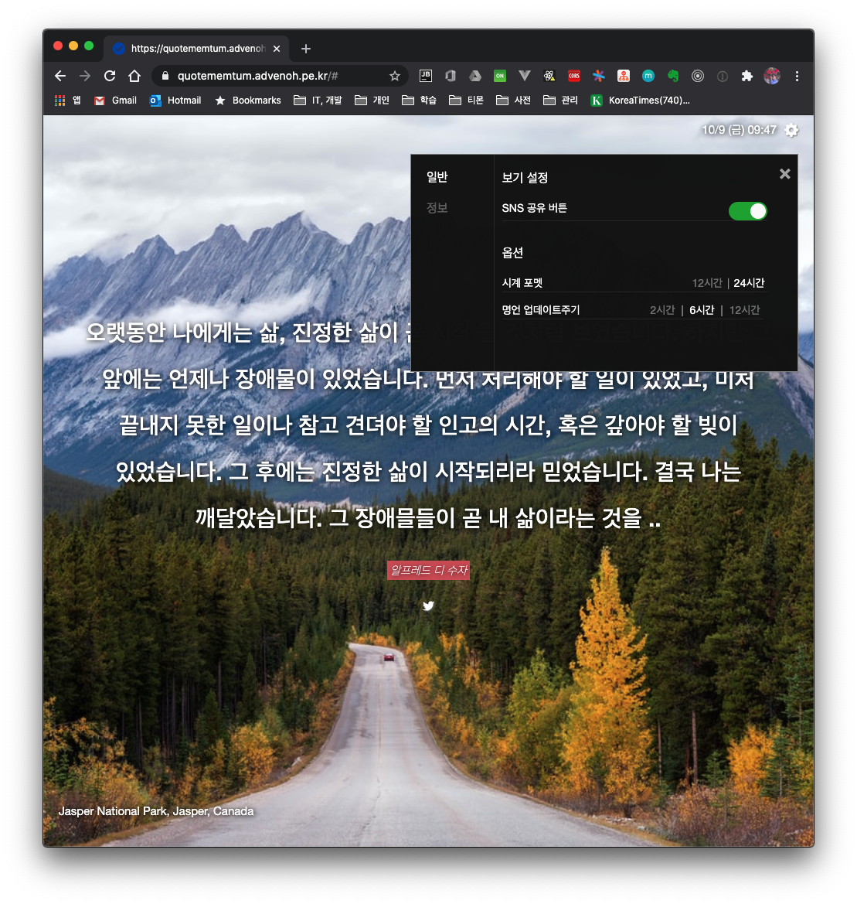

[](http://hits.dwyl.com/kenshin579/app-quotementum)
[](https://app.netlify.com/sites/quotememtum/deploys)

# 들어가며

**Quotememtum**은 개인적으로 많이 사용하는 **모멘텀**([Momentum](https://momentumdash.com/)) 프로젝트에 기반하여 작성되었습니다. **모멘텀**에서는 여러 기능(ex. Todo, 날씨, 시계)을 제공하지만, **Quotememtum**은 이름으로 바로 알 수 있듯이 **명언을 메인**으로 보여주는 사이트입니다.

# 기능

Quotememtum에서 제공하는 기능들입니다. 

- Daily 명언
  - 실제 명언은 http://quote.advenoh.pe.kr 사이트에서 제공하는 random API를 사용해서 가져온다
  - 현재 시간 및 날짜 제공
- 설정
  - 보기 설정 (ON / OFF)
    - SNS 공유 기능 활성화
  - 옵션 
    - 명언 업데이트 주기 및 시계 포멧

## Contributions

추후 개발할 내용은 Issue로 등록해두었고 누구나 개발에 참여할 수 있습니다. 아래 Issue 페이지를 참고해주세요. 

https://github.com/kenshin579/app-quotememtum/issues

# 빌드 및 실행

## 1. 개발 환경에서의 실행

개발환경에서는 `npm dependency` 설치 이후 `run dev-server` 옵션으로 실행하면 브라우져에서 사이트가 로딩됩니다. 

```bash
$ npm i
$ npm run dev-server
```


## 2. 프로덕션으로 빌드하기

`run build-production` 옵션으로 실행하면 `dist` 폴더가 생성되고 index 파일을 browser에서 로딩하면 됩니다. 

```bash
$ npm run build-production
```

# 화면

웹사이트도 제공하지만, chrome extension으로도 제공합니다. 




