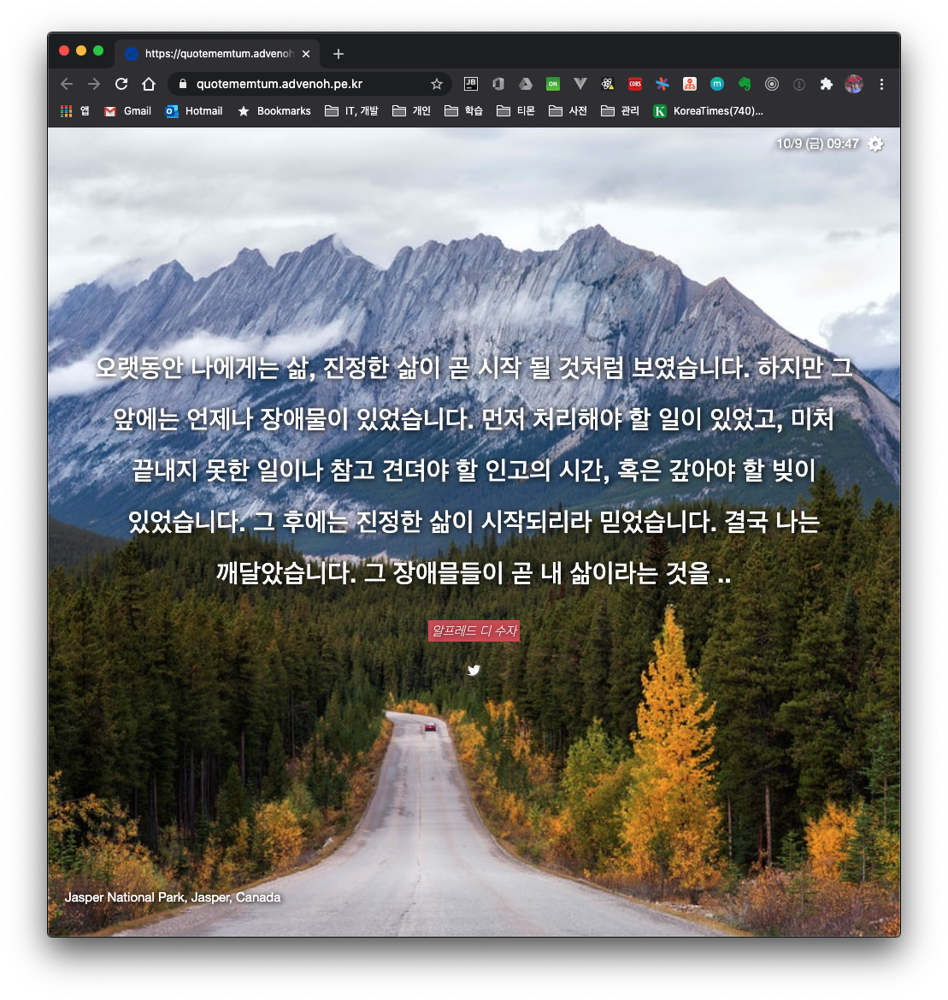

[](https://hits.seeyoufarm.com)

# Quotememtum

새 탭에서 매일 영감을 주는 명언을 만나보세요.

[Momentum](https://momentumdash.com/)에서 영감을 받아 만든 Chrome Extension으로, **명언**을 메인으로 보여줍니다.

## 기능

- 매일 새로운 명언 (InspireMe API 연동)
  - 오늘의 명언 / 랜덤 명언 모드
  - 한국어 / English 전환
  - 명언 클릭 시 InspireMe 사이트로 이동
- 실시간 시계 (12/24시간 형식)
- Unsplash 랜덤 배경 이미지
- 명언 북마크 (하트)
- 다크 모드
- 설정: 시계 형식, 명언 모드/주기, 언어, API Key 관리

## 기술 스택

- React 19 + TypeScript
- WXT (Chrome Extension 빌드 프레임워크)
- Tailwind CSS v4
- Chrome Manifest v3

## 빌드 및 실행

### 개발 환경

```bash
pnpm install
pnpm dev
```

### 프로덕션 빌드

```bash
pnpm build
```

빌드 결과물: `.output/chrome-mv3/`

### Chrome에서 로드

1. `chrome://extensions` 접속
2. "개발자 모드" 활성화
3. "압축 해제된 확장 프로그램을 로드합니다" 클릭
4. `.output/chrome-mv3` 폴더 선택

## API Key 설정

1. [inspireme.advenoh.pe.kr](https://inspireme.advenoh.pe.kr) 에서 로그인
2. 설정 → API Key 관리 → 새 키 발급
3. 확장 프로그램 설정 → API Key 탭에 입력

API Key 없이도 기본 명언이 표시됩니다.

## 스크린샷


